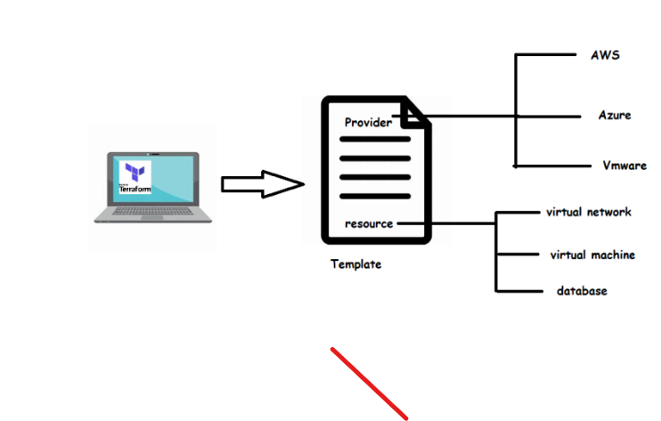

Terraform:
==========

* Terraform is a tool for building and changing, versioning infrastructure safely and efficiently.
* To express our infrastructure as a code terraform has its own domain specific language(DSL)
* To understand how terraform works, we need to know two key terms.

   * Resource: This is piece of infrastructure which you want to create.
   * Provider:  where the infrastructure has to be built/created.

 
Terraform providers: https://registry.terraform.io/browse/providers

* Each provider provide resource , which we can  user to create template.
* In Terraform Arguments are the inputs which you provide and Attributes are the outputs which terraform provides upon execution.

* Lets write terraform template to configure  s3 bucket (resource and provider)

By default terraform is a single executable that is downloaded into  your machine, if you want to execute terraform we need providers.

====

provider.tf: (Provider file)
============
provider "aws" {
  region = "us-east-1"
}

main.tf:(Resource File)
==========
resource "aws_s3_bucket" "mybucket"{
  bucket = "qts3fromtf"
}

